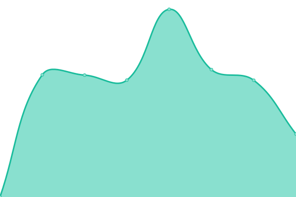
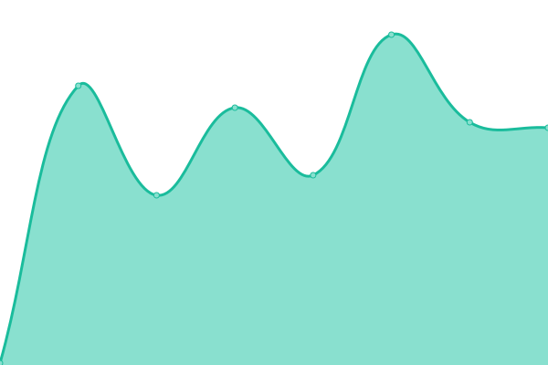
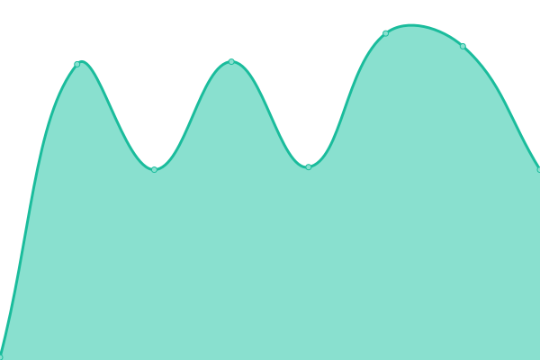
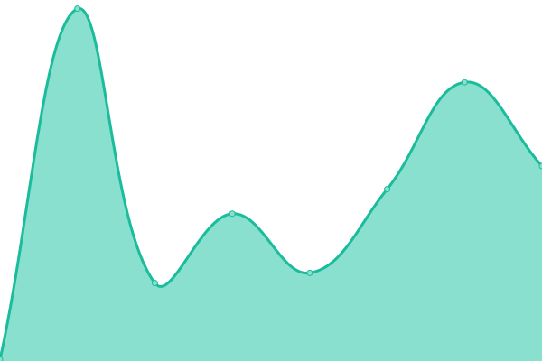

# [📈 Live Status](https://petermenocal.github.io/uptime): <!--live status--> **🟩 All systems operational**

This repository contains the open-source uptime monitor and status page for [Peter Menocal](https://petermenocal.com), powered by [Upptime](https://github.com/upptime/upptime).

With [Upptime](https://upptime.js.org), you can get your own unlimited and free uptime monitor and status page, powered entirely by a GitHub repository. We use [Issues](https://github.com/petermenocal/uptime/issues) as incident reports, [Actions](https://github.com/petermenocal/uptime/actions) as uptime monitors, and [Pages](https://petermenocal.github.io/uptime) for the status page.

<!--start: status pages-->
<!-- This summary is generated by Upptime (https://github.com/upptime/upptime) -->
<!-- Do not edit this manually, your changes will be overwritten -->
<!-- prettier-ignore -->
| URL | Status | History | Response Time | Uptime |
| --- | ------ | ------- | ------------- | ------ |
|  [Exhale Brands Website](https://www.exhalebrands.com/) | 🟩 Up | [exhale-brands-website.yml](https://github.com/petermenocal/uptime/commits/master/history/exhale-brands-website.yml) | 

 2506ms
     
 | 

<a href="https://petermenocal.github.io/uptime/history/exhale-brands-website">100.00%</a>
    

|  [Effex Supply Co. Website](https://effexsupply.com) | 🟩 Up | [effex-supply-co-website.yml](https://github.com/petermenocal/uptime/commits/master/history/effex-supply-co-website.yml) | 

 522ms
     
 | 

<a href="https://petermenocal.github.io/uptime/history/effex-supply-co-website">9.62%</a>
    

|  [SMS Dashboard](http://cherami.exhalenevada.com:3000/) | 🟩 Up | [sms-dashboard.yml](https://github.com/petermenocal/uptime/commits/master/history/sms-dashboard.yml) | 

 279ms
     
 | 

<a href="https://petermenocal.github.io/uptime/history/sms-dashboard">100.00%</a>
    

|  [Mail System](https://box.effexsupply.com/mail/) | 🟩 Up | [mail-system.yml](https://github.com/petermenocal/uptime/commits/master/history/mail-system.yml) | 

 843ms
     
 | 

<a href="https://petermenocal.github.io/uptime/history/mail-system">100.00%</a>
    

|  [Budtender Control Panel](https://xorders.web.app/) | 🟩 Up | [budtender-control-panel.yml](https://github.com/petermenocal/uptime/commits/master/history/budtender-control-panel.yml) | 

 493ms
     
 | 

<a href="https://petermenocal.github.io/uptime/history/budtender-control-panel">100.00%</a>
    

|  [People Management Control Panel](https://xpeople.web.app/) | 🟩 Up | [people-management-control-panel.yml](https://github.com/petermenocal/uptime/commits/master/history/people-management-control-panel.yml) | 

 437ms
     
 | 

<a href="https://petermenocal.github.io/uptime/history/people-management-control-panel">100.00%</a>
    

|  [Now Serving Control Panel](https://xserving-admin.web.app/) | 🟩 Up | [now-serving-control-panel.yml](https://github.com/petermenocal/uptime/commits/master/history/now-serving-control-panel.yml) | 

 540ms
     
 | 

<a href="https://petermenocal.github.io/uptime/history/now-serving-control-panel">100.00%</a>
    

|  [Stats Dashboard](https://xstats.web.app/) | 🟩 Up | [stats-dashboard.yml](https://github.com/petermenocal/uptime/commits/master/history/stats-dashboard.yml) | 

 547ms
     
 | 

<a href="https://petermenocal.github.io/uptime/history/stats-dashboard">100.00%</a>
    

|  [Store Menu - Now Serving Display](https://xserving.web.app) | 🟩 Up | [store-menu-now-serving-display.yml](https://github.com/petermenocal/uptime/commits/master/history/store-menu-now-serving-display.yml) | 

 415ms
     
 | 

<a href="https://petermenocal.github.io/uptime/history/store-menu-now-serving-display">100.00%</a>
    

|  [Store Menu - Concentrates](https://xconcentrates.web.app/) | 🟩 Up | [store-menu-concentrates.yml](https://github.com/petermenocal/uptime/commits/master/history/store-menu-concentrates.yml) | 

 464ms
     
 | 

<a href="https://petermenocal.github.io/uptime/history/store-menu-concentrates">100.00%</a>
    

|  [Store Menu - Edibles](https://xedibles.web.app/) | 🟩 Up | [store-menu-edibles.yml](https://github.com/petermenocal/uptime/commits/master/history/store-menu-edibles.yml) | 

 647ms
     
 | 

<a href="https://petermenocal.github.io/uptime/history/store-menu-edibles">100.00%</a>
    

|  [Store Menu - Flower](https://xflower.web.app/) | 🟩 Up | [store-menu-flower.yml](https://github.com/petermenocal/uptime/commits/master/history/store-menu-flower.yml) | 

 598ms
     
 | 

<a href="https://petermenocal.github.io/uptime/history/store-menu-flower">100.00%</a>
    

|  [Store Menu - Prerolls](https://xprerolls.web.app/) | 🟩 Up | [store-menu-prerolls.yml](https://github.com/petermenocal/uptime/commits/master/history/store-menu-prerolls.yml) | 

 613ms
     
 | 

<a href="https://petermenocal.github.io/uptime/history/store-menu-prerolls">100.00%</a>
    

|  [Store Menu - Vapes](https://xvapes.web.app/) | 🟩 Up | [store-menu-vapes.yml](https://github.com/petermenocal/uptime/commits/master/history/store-menu-vapes.yml) | 

 445ms
     
 | 

<a href="https://petermenocal.github.io/uptime/history/store-menu-vapes">100.00%</a>
    

<!--end: status pages-->

[**Visit our status website →**](https://petermenocal.github.io/uptime)

## 📄 License

- Powered by: [Upptime](https://github.com/upptime/upptime)
- Code: [MIT](./LICENSE) © [Peter Menocal](https://petermenocal.com)
- Data in the `./history` directory: [Open Database License](https://opendatacommons.org/licenses/odbl/1-0/)
